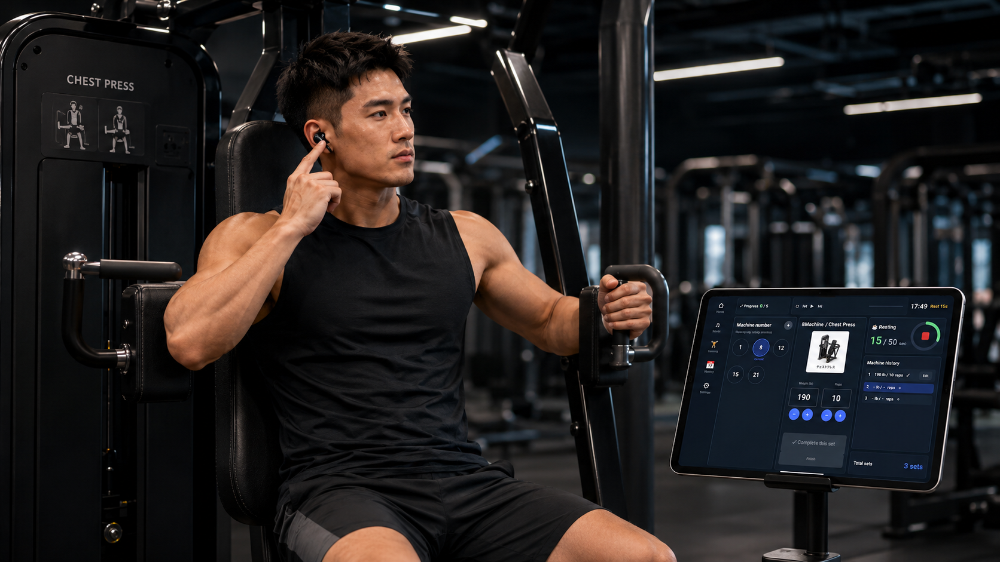
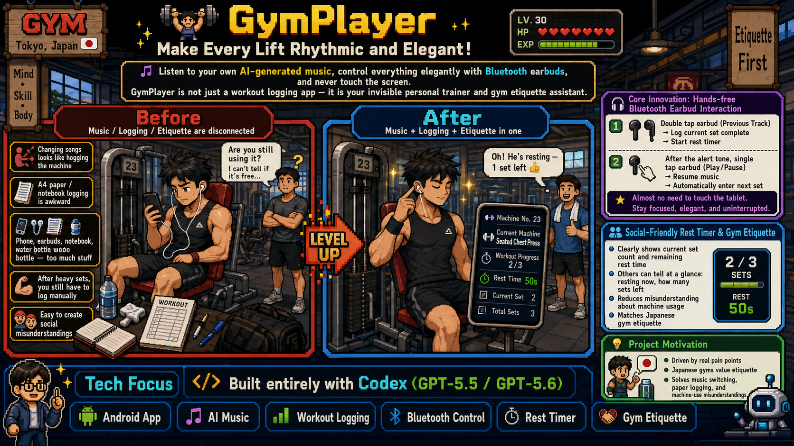
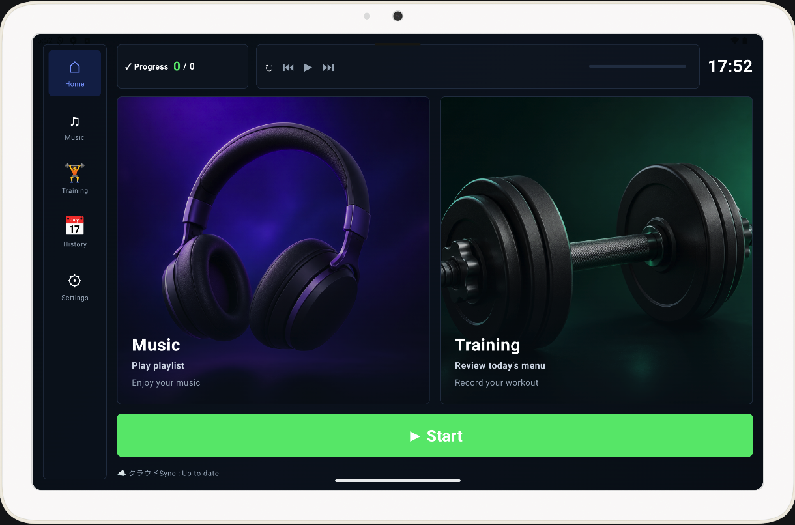
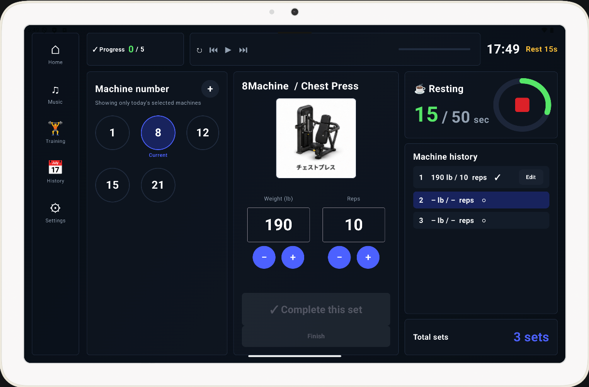
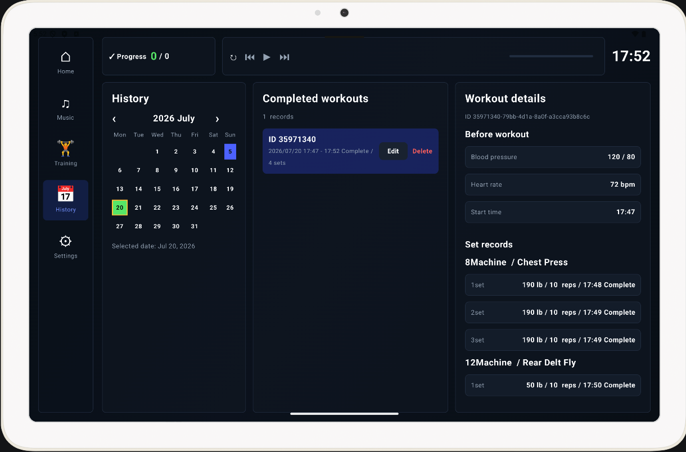
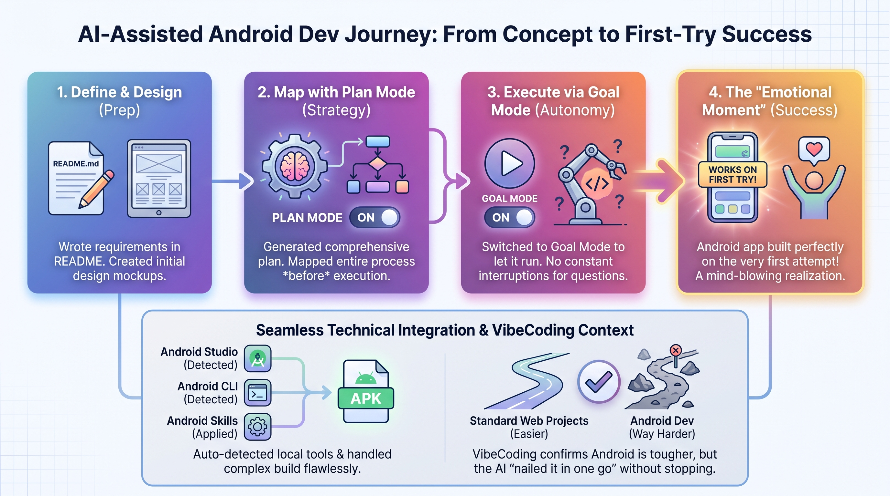
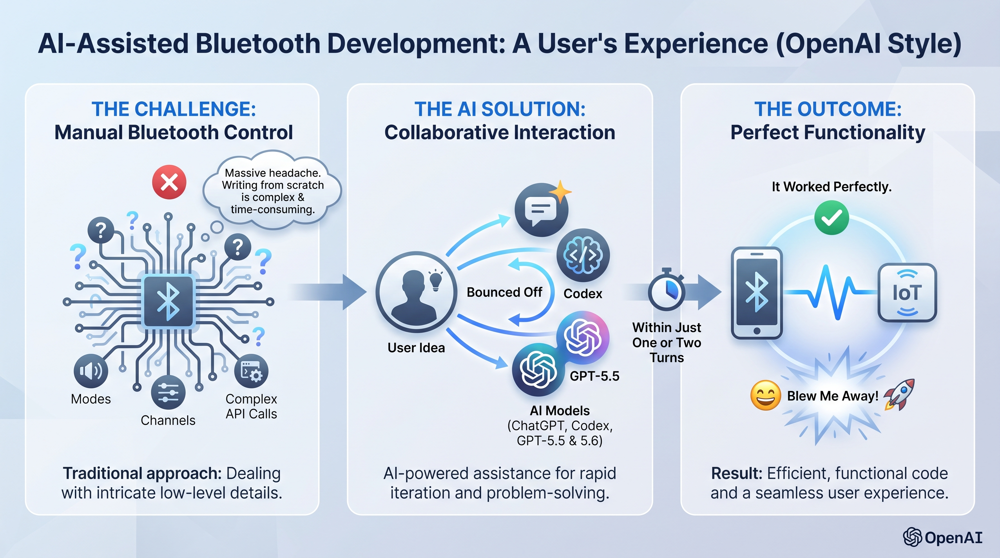
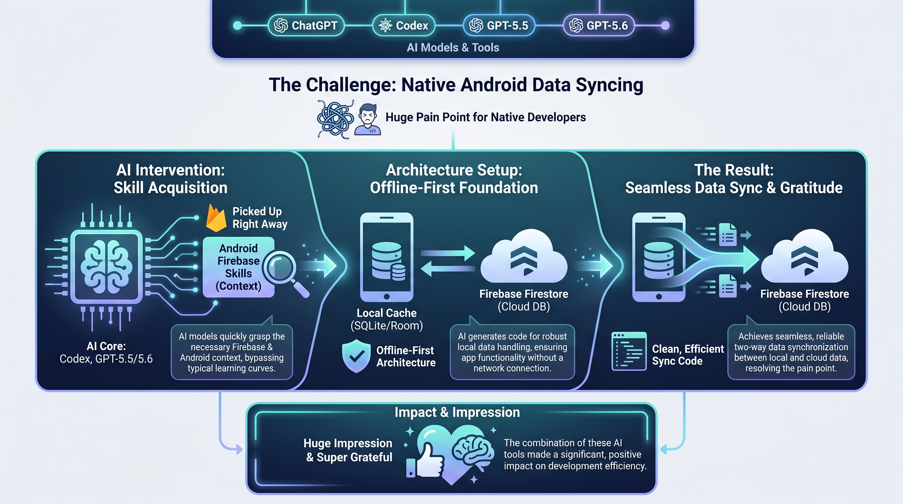

# 🏋️‍♂️ GymPlayer: Powering Every Lift with Rhythm and Grace!

> **🎵 Listen to your custom AI music and elegantly take full control via Bluetooth headphones—without ever touching the screen. GymPlayer isn't just a workout tracker; it's your invisible personal trainer and gym etiquette butler.**




## 💡 Original Vision: A Geek’s Romance Born from Real Pain Points

The market is flooded with fitness apps, yet in actual gym settings, they often overlook subtle but critical pain points:

* Constant switching between music apps breaks your flow state.
* The awkwardness of logging sets with pen and paper right after heavy lifting.
* Social discomfort caused by occupying machines longer than necessary due to unclear rest intervals.

As a developer who loves lifting and enjoys creating AI music with Suno, I decided to build my own Android app—one that is **more meticulous, human-centric, and attuned to gym culture**. Thus, GymPlayer was born! It seamlessly merges music, logging, and etiquette to elevate workout efficiency and experience to a whole new level!

---

## 🚀 Key Highlights & Innovations (Why GymPlayer?)

### 🎧 1. Revolutionary "Headphone-Driven" Touchless Interaction (⭐ Core Innovation)

This is the feature I am most proud of! **Log your entire workout without ever touching your tablet screen.**

* **Operating Logic**: Cleverly redefines Bluetooth headphone controls (Previous Track / Play-Pause) as app commands.
* **Elegant Closed Loop**:
1. **Start Rest**: Finish a set, double-press (Previous Track), and the app voice announces: *"Set completed, entering rest mode,"* automatically starting the countdown.
2. **Next Set**: When the rest time ends, a prompt sounds in your headphones. Single-press (Play-Pause), and the app automatically resumes music playback while recording the transition to the next set.


* **The Experience**: To onlookers, you look like a focused pro training with headphones on—saying goodbye to the chaos of setting down weights, wiping sweat, and tapping away at a screen!

### ⏱️ 2. Socially-Friendly "Rest & Etiquette" Timer

In Japanese gym culture, etiquette is paramount. For scientific training routines like "3 consecutive sets per machine, with rest times under 50 seconds":

* **Intuitive Progress Display**: Clearly displays the current set count and remaining rest time on screen.
* **Eliminates Social Misunderstandings**: Anyone walking by can see at a glance: *"Ah, they're resting, finished 2 sets, 1 left."* This preserves your personal training rhythm while balancing courtesy toward others.

### 🎵 3. Deeply Integrated Offline Music Experience

* **Offline First**: Out of respect for gyms that prioritize privacy (or restrict Wi-Fi access), the app supports full offline playback—no network required once downloaded.
* **Personalized Motivation**: Native support for playing local music files (including my collection of custom AI gym tracks made with Suno!). Music and training become one, boosting your drive to power through.

### 📊 4. Ditch Pen & Paper: Efficient Digital Routine Management

* **Auto-Generation & Clear Guidance**: Set up your daily routine in one tap before workouts, showing required machines and completion status at a glance.
* **Adaptable to Busy Crowds**: Supports multi-machine selection. Even if the gym is crowded and you need to switch exercise order on the fly, you can easily manage remaining progress without missing a beat.

---

## 🛠️ Tech Stack (Built With)

This project was built using Codex in GPT-5.5 and GPT-5.6 modes—a 100% VibeCoding development experience without writing a single line of manual code. Here's what was achieved with Codex:

* **Language & UI**: Kotlin, Android Jetpack Compose
* **Media Playback**: Media3 ExoPlayer, MediaSession (Full support for Bluetooth media buttons)
* **Local Storage**: Room Database, DataStore
* **Cloud Services**: Firebase Authentication, Cloud Firestore, Firebase Storage
* **Build Tool**: Gradle Kotlin DSL




---

## 📈 Body Metrics & Cloud Sync

* **Comprehensive Data Tracking**: Tracks pre-workout blood pressure/pulse, alongside post-workout weight, body fat %, muscle mass, body water %, BMI, basal metabolism, and visceral fat.
* **Offline-First Architecture**: Operates offline by default to avoid gym network constraints. All data is safely stored in a local Room database, then synced to Firestore with one tap upon returning home, laying a solid foundation for future data analytics.



---

## 🔮 Future Outlook & Developer Notes

1. **🤖 AI Training Analytics**: The app has yielded fantastic real-world training results and earned my trainer's seal of approval! Once enough data accumulates, I plan to introduce AI-driven analytics to provide users with data-backed training suggestions and optimization plans.
2. **🛡️ Hardware Safety Upgrades**: *(Real story alert 🚨)* During testing, intense machine vibration caused my tablet to fall and shatter its screen. **(Yep, if the promotional images show a scuffed screen, that's a real "badge of honor" from the battlefield, haha!)** While the screen got cracked, it sparked new inspiration: I'll be exploring sturdier physical mounting solutions or optimizing for portrait mode to protect hardware in the future.

---

## ⚡ Quick Start

Want to try it out or contribute? Get it running locally in just a few simple steps:

### 1. Clone the Repository

```bash
git clone https://github.com/your-username/gymplayer.git
cd gymplayer

```

### 2. Configure Firebase

1. Create a new project in the [Firebase Console](https://console.firebase.google.com/).
2. Add an Android app with the Package Name: `com.vibecodingjapan.gymplayer`
3. Download `google-services.json` and place it in the `app/` directory (already added to `.gitignore`).
4. Enable **Email/Password Authentication** in the Firebase Console.
5. Deploy Firestore Rules: `firebase deploy --only firestore:rules`

### 3. Initialize Machine Data (Optional)

The `tool` directory contains Node.js scripts for uploading and updating gym machine information. Run this code to update your machine data.

---

## 🤝 Contribution & Feedback

GymPlayer started as a solution to a personal pain point, but I hope it brings value to every fitness enthusiast out there.

If you face similar frustrations at the gym or have cool ideas for interactions, feel free to submit an Issue or Pull Request!

**💪 Let’s build better bodies and lives together through code!**

---

## Test Account:

* Android APK: [gymplayer-ver1.apk](app_installfile/gymplayer-ver1.apk)
* Email: test@vibecodingjapan.com
* Password: testtest

---

#  ❣️ How Codex and GPT-5.6 were used
Next, I’d love to share how ChatGPT, Codex, and GPT-5.5 and 5.6 actually helped me out.

First, I started by writing down my requirements in a README file, along with a few design mockups. What blew my mind was using Plan Mode. I had it map out the entire plan first, but instead of executing right away, I switched over to Goal Mode to let it run. And honestly, this Android app worked on the very first try! That was such an emotional moment for me. It automatically detected that I had the latest Android Studio installed—along with the Android CLI and Android Skills—and handled the whole build seamlessly. If you’ve ever tried VibeCoding, you know Android dev is way harder than standard web projects. But it didn't keep stopping to ask me questions—it just nailed it in one go.


Second, bluetooth control. If you were to write this from scratch, dealing with all the modes, channels, and complex API calls is a massive headache. I just had a sudden idea, bounced it off GPT-5.5 and 5.6, and within just one or two turns, it worked perfectly. That really blew me away.


Finally, data syncing with Firebase Firestore. It picked up on the Android Firebase Skills right away, setting up an Offline-First architecture with seamless data sync. For native developers, this is usually a huge pain point.

These three things left a huge impression on me, and I’m super grateful for Codex and GPT-5.5 and 5.6.
