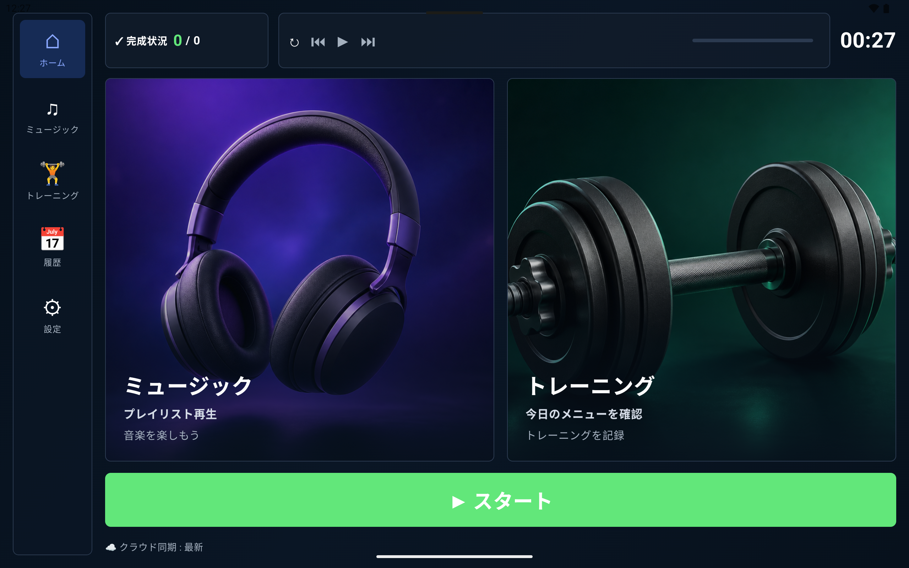
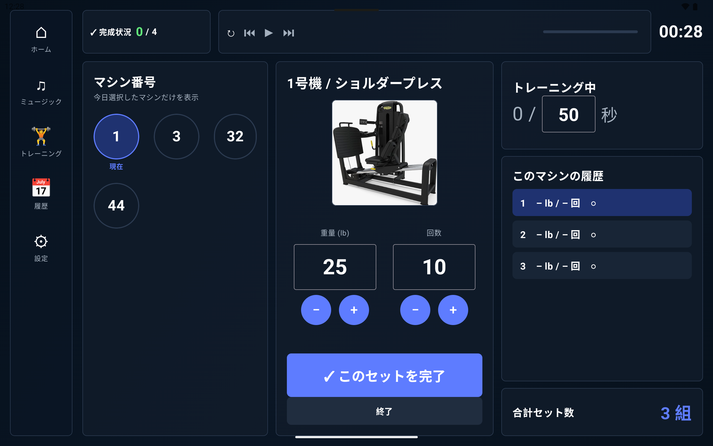
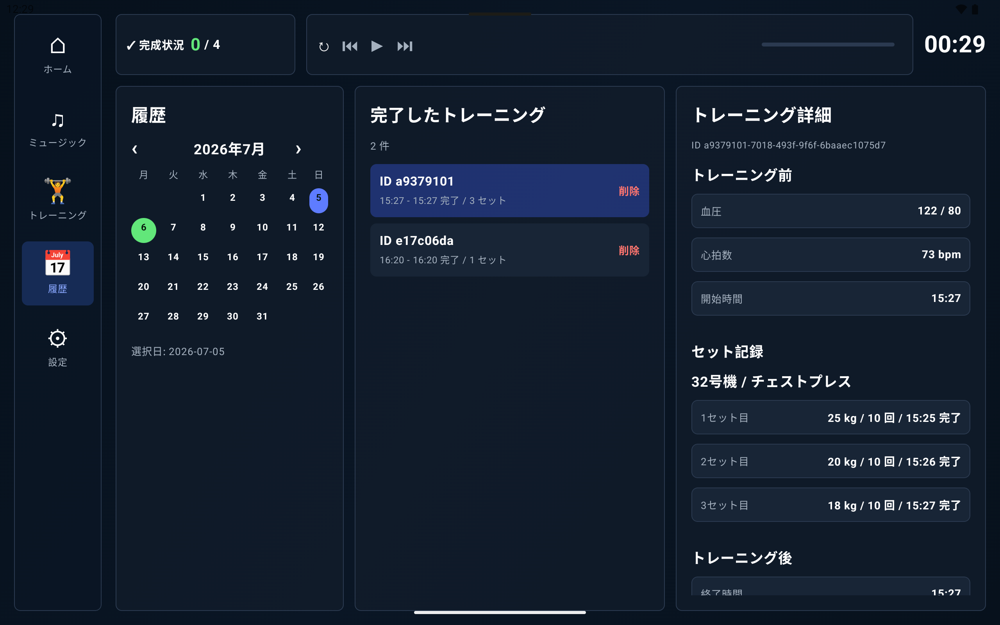

# GymPlayer


GymPlayerは、ジムで音楽を聴きながらトレーニングを進め、セット・休憩・身体データをその場で記録できるAndroidアプリです。Bluetoothイヤホンで音楽に集中していると休憩タイマーを聞き逃しやすい、混雑時にマシンを移動すると進捗がわからなくなる、紙やメモアプリに残した記録をあとで分析しづらい、というジム現場の小さなストレスをまとめて解決することを目指しています。

## 解決するペインポイント

- 音楽を聴きながら、休憩タイマー音も聞ける  
  Media3/ExoPlayerで音楽を再生しつつ、休憩終了時にはアラーム音を鳴らします。特にBluetoothイヤホン利用時でも、音楽だけで休憩終了に気づけない問題を減らします。
- トレーニングデータを記録できる  
  マシン、セット数、重量、回数、開始前の血圧・脈拍、終了後の体重・体脂肪率・筋肉量などを保存できます。
- 混雑時に途中でマシンを変えても進捗を続けられる  
  複数マシンを選択してワークアウトを開始でき、各マシンごとの完了セットを管理します。ジムが混んでいて順番を入れ替えても、残りセットや進捗を確認しながら続けられます。
- 記録をIT化し、将来の分析に使える  
  ローカルDBに保存したトレーニング履歴をFirebaseに同期できます。今後、部位別ボリューム、重量推移、体組成変化などの分析につなげやすいデータ基盤になります。





## 主な機能

- 音楽プレイヤー
  - 端末内フォルダからプレイリストを作成
  - 曲の再生、一時停止、次/前の曲、曲順保存
  - プレイリストループ、1曲リピート、シャッフル再生
  - Bluetoothイヤホンなどのメディアボタン操作に対応
- トレーニング管理
  - Firebaseからマシン一覧とマシン画像を同期
  - 今日使うマシンを複数選択
  - セットごとに重量・回数を記録
  - 休憩タイマーと休憩終了アラーム
  - lb/kg表示切り替え
- 身体データ記録
  - トレーニング前の血圧・脈拍
  - トレーニング後の体重、体脂肪率、筋肉量、体水分率、BMI、基礎代謝、内臓脂肪
- 履歴・同期
  - Roomによるローカル保存
  - Firebase Authenticationでログイン
  - Firestoreへワークアウト履歴を同期
  - 削除したワークアウトも次回同期時にクラウドへ反映

## 技術スタック

- Kotlin
- Android Jetpack Compose
- Media3 ExoPlayer / MediaSession
- Room
- DataStore
- Firebase Authentication
- Cloud Firestore
- Firebase Storage
- Gradle Kotlin DSL

## セットアップ

### 1. Firebaseプロジェクトを作成

1. [Firebase Console](https://console.firebase.google.com/)でプロジェクトを作成します。
2. Androidアプリを追加します。
3. Android package nameには次を指定します。

```text
com.vibecodingjapan.gymplayer
```

4. `google-services.json`をダウンロードします。

### 2. google-services.jsonを配置

ダウンロードした`google-services.json`は、プロジェクト直下ではなくAndroidアプリモジュール直下に置きます。

```text
gymplayer/
  app/
    google-services.json
```

つまり、このリポジトリでは次の場所です。

```text
app/google-services.json
```

`google-services.json`にはプロジェクト固有の設定が含まれるため、通常はGitにコミットしないでください。このリポジトリの`.gitignore`でも`google-services.json`は除外対象です。

### 3. Firebase Authenticationを設定

Firebase Consoleで次を有効化します。

1. Authenticationを開く
2. Sign-in methodを開く
3. Email/Passwordを有効化
4. テスト用ユーザーを作成

アプリの設定画面から、このメールアドレスとパスワードでログインします。

### 4. Cloud Firestoreを設定

Firestore Databaseを作成し、ルールをデプロイします。

```bash
firebase deploy --only firestore:rules
```

このリポジトリの`firestore.rules`では、次のようなアクセス制御になっています。

- `users/{uid}/...`: ログイン中の本人だけが読み書き可能
- `machines`: ログイン済みユーザーは読み取り可能、アプリからの書き込みは禁止

### 5. Firebase Storageを設定

マシン画像を使う場合はFirebase Storageを有効化し、画像をアップロードします。Firestoreの`machines`コレクションに`imageStorageUrl`を保存すると、同期時にアプリが画像を取得します。

`imageStorageUrl`の例:

```text
gs://your-project-id.appspot.com/machines/chest_press.png
```

### 6. マシンマスタをFirestoreに登録

アプリはFirestoreの`machines`コレクションからマシン一覧を取得します。各ドキュメントには、最低限次のフィールドを用意してください。

| フィールド | 型 | 説明 |
| --- | --- | --- |
| `number` | string | マシン番号。例: `11`、`11a`、`11b` |
| `name` | string | マシン名 |
| `bodyPart` | string | 対象部位 |
| `icon` | string | 表示用アイコン |
| `targetSets` | number | 目標セット数 |
| `defaultWeight` | number | 初期重量 |
| `imageStorageUrl` | string | Firebase Storage画像URL。任意 |
| `updatedAt` | number | 更新時刻。任意 |

例:

```json
{
  "number": "11a",
  "name": "Chest Press",
  "bodyPart": "Chest",
  "icon": "🏋",
  "targetSets": 3,
  "defaultWeight": 40,
  "imageStorageUrl": "gs://your-project-id.appspot.com/machines/chest_press.png",
  "updatedAt": 1720000000000
}
```

### 7. ビルドと起動

Android Studioでプロジェクトを開くか、次のコマンドでビルドします。

```bash
./gradlew assembleDebug
```

テストを実行する場合:

```bash
./gradlew test
```

## 使い方

1. Firebase Authenticationのメールアドレスとパスワードでログインします。
2. 同期を実行し、マシン一覧を取得します。
3. 音楽画面で端末内フォルダからプレイリストを作成します。
4. トレーニングメニューで今日使うマシンを選択します。
5. トレーニング前の血圧・脈拍を入力します。
6. セットごとに重量・回数を記録し、休憩タイマーに沿って進めます。
7. トレーニング後の身体データを入力して保存します。
8. 履歴画面で過去のワークアウトを確認し、必要に応じてFirebaseへ同期します。

## 今後の拡張アイデア

- 部位別・マシン別のトレーニングボリューム分析
- 重量、回数、体組成の推移グラフ
- 混雑状況に応じた代替マシン提案
- Firebase上のデータを使ったダッシュボード化
- トレーニングメニューのCSV/スプレッドシート取り込み強化
