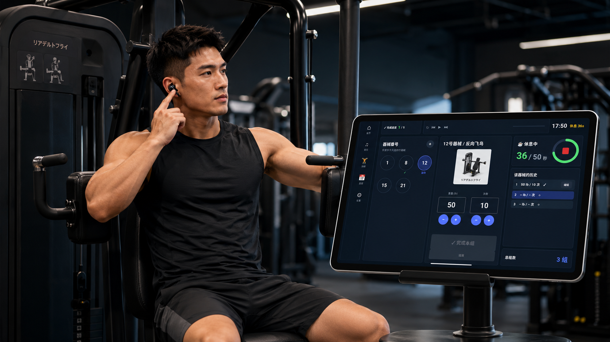
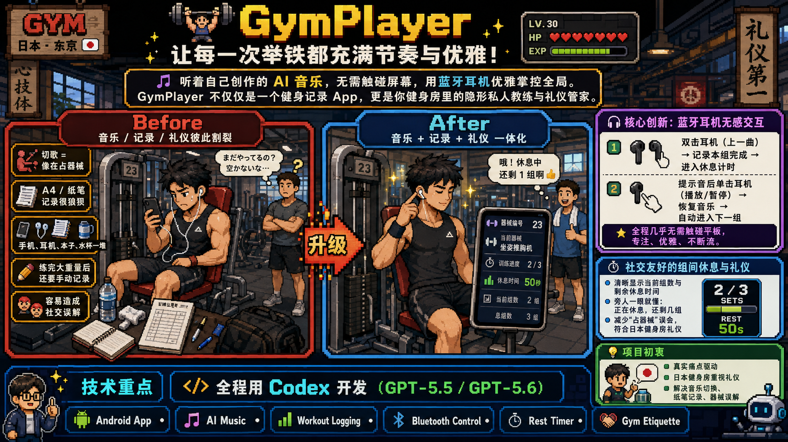
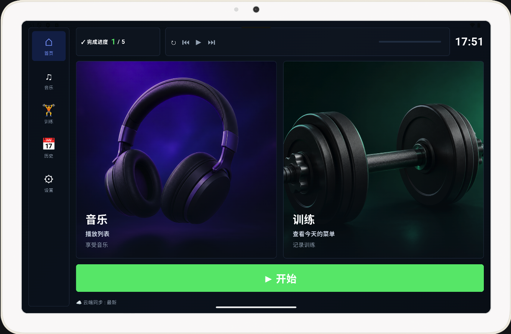
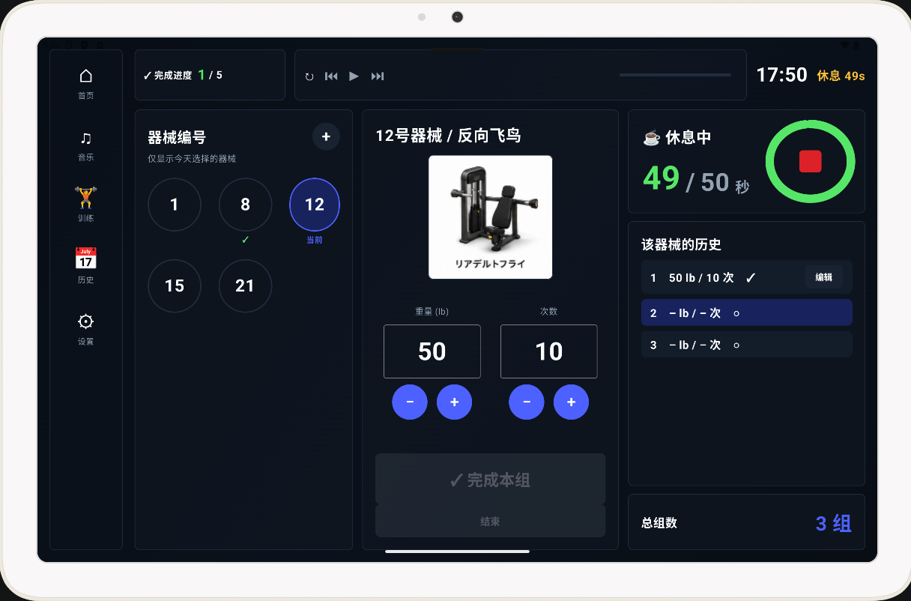
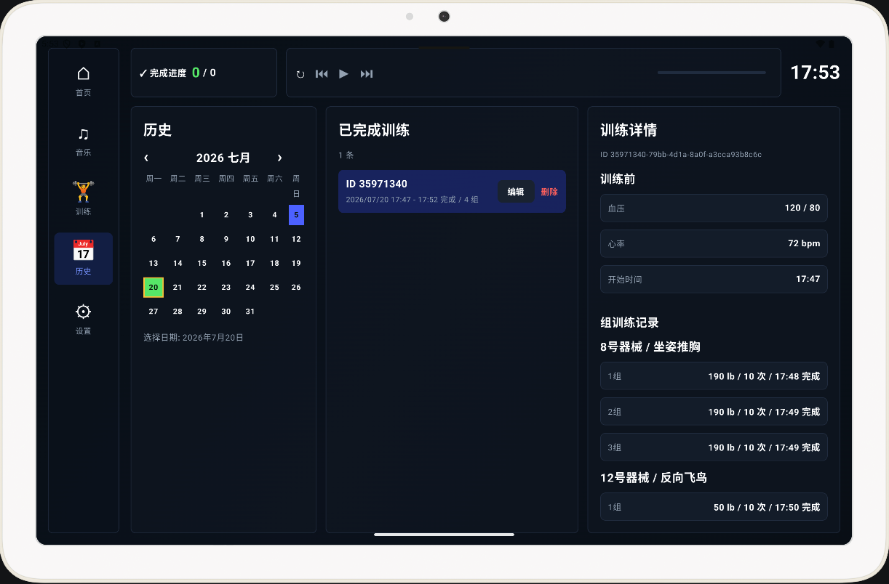

# 🏋️‍♂️ GymPlayer：让每一次举铁都充满节奏与优雅！

> **🎵 听着自己创作的 AI 音乐，无需触碰屏幕，用蓝牙耳机优雅掌控全局。GymPlayer 不仅仅是一个健身记录 App，更是你健身房里的隐形私人教练与礼仪管家。**




## 💡 项目初衷：源于真实痛点的极客浪漫

市面上的健身 App 琳琅满目，但在真实的健身房场景中，它们往往忽略了几个微小却致命的痛点：
- 频繁切换音乐 App 打断心流
- 大重量训练后手持纸笔记录的狼狈
- 以及因组间休息不明导致的“器械占用”社交尴尬。

作为一名热爱健身且热衷于用 Suno 创作 AI 音乐的开发者，我决定自己动手，打造一款**更细致、更人性化、更懂健身房文化**的 Android 应用。GymPlayer 应运而生，它将音乐、记录与礼仪完美融合，让训练效率与体验实现质的飞跃！

---

## 🚀 核心亮点与创新 (Why GymPlayer?)

### 🎧 1. 革命性的“蓝牙耳机”无感交互（⭐ 核心创新）
这是我最引以为傲的设计！**全程无需触碰平板电脑，即可完成所有记录操作。**
* **操作逻辑**：巧妙重定义蓝牙耳机线控功能（上一曲 / 播放/暂停）为 App 指令。
* **优雅闭环**：
  1. **开启休息**：一组结束，双击耳机（上一曲），App 语音播报：“这组做完了，进入休息模式”，并自动开始读秒。
  2. **进入下一组**：休息结束，耳机响起提示音。单击耳机（播放/暂停），App 自动恢复音乐播放，并记录进入下一组。
* **体验**：对于旁人而言，你只是戴着耳机专注锻炼的专业人士，彻底告别放下器械、擦汗再去戳屏幕的忙乱！

### ⏱️ 2. 社交友好的“组间休息与礼仪”计时器
在日本健身房文化中，礼仪至关重要。针对“同一器械连续三组，每组休息不超过50秒”的科学训练法：
* **直观进度展示**：屏幕清晰显示当前组数及剩余休息时间。
* **消除社交误解**：路过想使用该器械的人一眼就能看出：“哦，他正在休息，已经完成2组，还剩1组”。既保障了个人训练节奏，又完美平衡了与他人礼让的需求。

### 🎵 3. 深度集成的离线音乐体验
* **离线优先**：考虑到部分健身房对隐私的重视（不允许连接 WiFi），App 支持完全离线播放，下载后无需网络即可全程顺畅操作。
* **个性化动力**：完美支持播放本地音乐（包括我用 Suno 创作的大量专属 AI 健身歌曲！），音乐与训练合二为一，极大提升锻炼积极性。

### 📊 4. 告别纸笔，高效的数字化菜单管理
* **自动生成与清晰指引**：训练前一键设置今日菜单，一眼看清所需器械及完成状态。
* **灵活应对拥挤**：支持多器械选择，即使健身房拥挤需要临时更换器械顺序，也能轻松掌握剩余进度，绝不遗漏。

---

## 🛠️ 技术栈 (Built With)

本项目采使用Codex的GPT5.5, GPT5.6模式开发，没有写一行代码完全VibeCoding开发。用Codex达成的技术实现：

* **语言 & UI**: Kotlin, Android Jetpack Compose
* **媒体播放**: Media3 ExoPlayer, MediaSession (完美支持蓝牙媒体按钮)
* **本地存储**: Room Database, DataStore
* **云端服务**: Firebase Authentication, Cloud Firestore, Firebase Storage
* **构建工具**: Gradle Kotlin DSL




---

## 📈 身体数据与云端同步

* **全方位数据记录**：支持记录训练前的血压/脉搏，以及训练后的体重、体脂率、肌肉量、体水分率、BMI、基础代谢和内脏脂肪。
* **Offline-First 架构**：App 默认为离线模式，避免健身房网络限制。所有数据先安全保存于本地 Room 数据库，回到家后一键同步至 Firestore，为未来的数据分析打下坚实基础。




---

## 🔮 未来展望 & 开发者碎碎念

1. **🤖 AI 训练分析**：目前 App 已在实际锻炼中取得极佳效果，并获得了教练的认可！下一步，我计划在积累足够数据后，引入 AI 分析功能，为用户提供基于数据的科学训练建议与优化方案。
2. **🛡️ 硬件安全升级**：*（真实故事警告 🚨）* 在实际测试中，我曾因器械剧烈振动导致平板跌落碎屏。**（没错，你看到的宣传图里屏幕有点花，那就是实战留下的“勋章”，哈哈！）** 虽然屏幕花了，但它给了我新的灵感：未来我将探索更稳固的物理固定方案，或优化为竖屏模式，确保硬件安全。

---

## ⚡ 快速开始 (Quick Start)

想要亲自体验或贡献代码？只需简单几步即可在本地运行：

### 1. 克隆项目
```bash
git clone https://github.com/your-username/gymplayer.git
cd gymplayer
```

### 2. 配置 Firebase
1. 在 [Firebase Console](https://console.firebase.google.com/) 创建新项目。
2. 添加 Android 应用，Package name 填写：`com.vibecodingjapan.gymplayer`
3. 下载 `google-services.json` 并放置于 `app/` 目录下（已加入 `.gitignore`，请放心）。
4. 在 Firebase Console 中启用 **Email/Password Authentication**。
5. 部署 Firestore 规则：`firebase deploy --only firestore:rules`

### 3. 初始化机器数据 (可选)
在本工程中的 `tool`目录下，有上传更新健身器械的node.js代码，使用此代码可以更新你的健身器械信息。

---

## 🤝 贡献与反馈

GymPlayer 源于个人痛点，但希望它能造福每一位热爱健身的朋友。  
如果你在健身房也有类似的烦恼，或者有更好的交互灵感，欢迎提交 Issue 或 Pull Request！

**💪 让我们一起，用代码塑造更好的身体与生活！**


## Account for Test:
- Android APK: [gymplayer-ver1.apk](app_installfile/gymplayer-ver1.apk)
- Email: test@vibecodingjapan.com
- Password: testtest