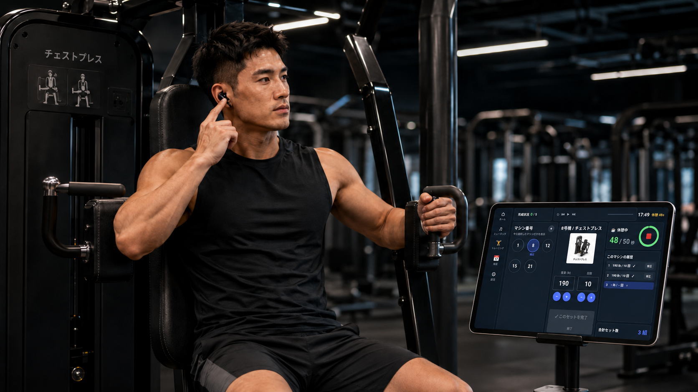
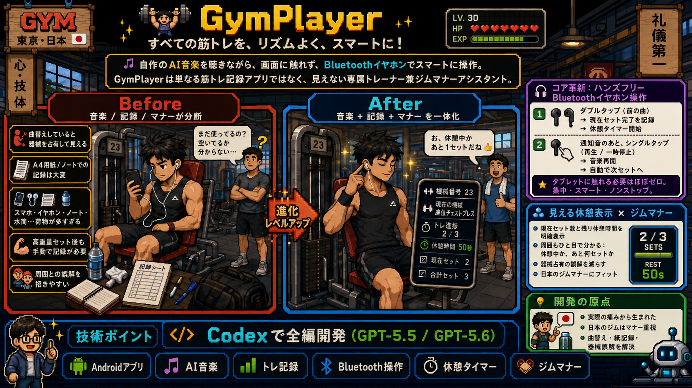
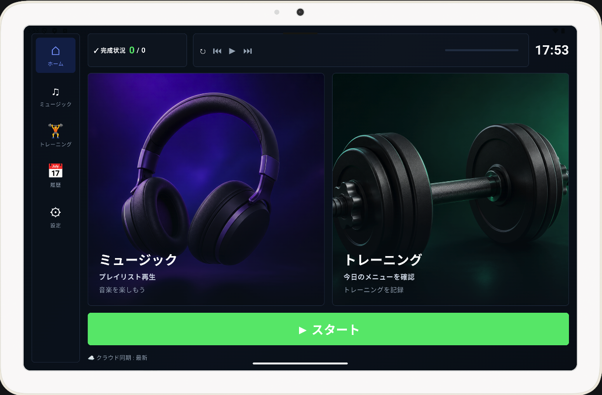
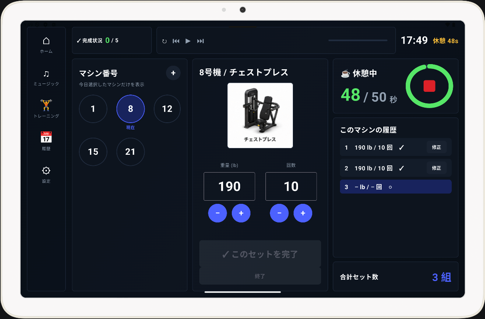
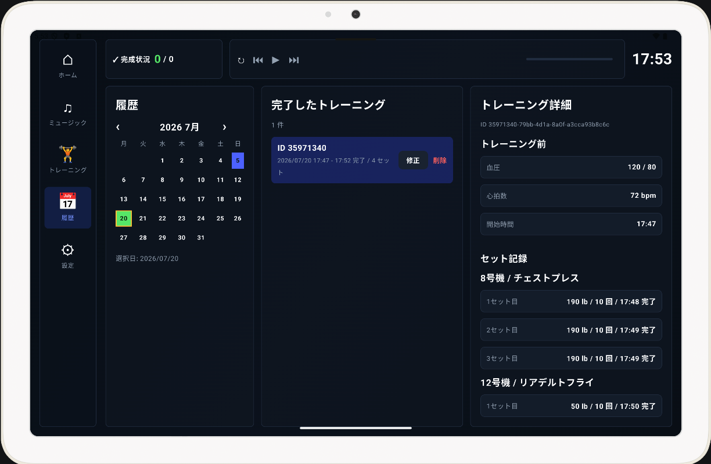

# 🏋️‍♂️ GymPlayer：トレーニングに、心躍るリズムと洗練されたスマートさを！

> **🎵 自分でプロデュースしたAIミュージックに身をゆだね、画面に一切触れることなくBluetoothイヤホンだけでスマートに完全コントロール。GymPlayerは単なる筋トレ記録アプリではありません。ジムにおけるあなたの「見えないパーソナルトレーナー」であり、「マナーの執事」です。**




## 💡 開発のきっかけ：リアルな悩みが生んだ、ギークのロマン

世の中には数多くのフィットネスアプリが存在しますが、実際のジムという現場において、それらは細かな、しかし致命的なストレスを見落としがちです。

* 音楽アプリの頻繁な切り替えによる没入感（フロー状態）の中断
* 高重量のセット直後に、ペンと紙を手に汗だくで記録する煩わしさ
* 箸休めならぬインターバルの目安が曖昧なことで生じる「マシン占有」の気まずさ

筋トレを愛し、Sunoを使ったAI音楽制作にハマっている一人のエンジニアとして、私は**もっと細やかで、人間味があり、ジムのカルチャーを熟知した**Androidアプリを自分の手で作ろうと決意しました。こうして誕生したのがGymPlayerです。音楽、ログ管理、そしてジムマナーを高度に融合させ、トレーニングの効率と体験を飛躍的に高めます！

---

## 🚀 主な特徴と革新性（Why GymPlayer?）

### 🎧 1. 革命的な「完全ハンズフリー」イヤホン操作（⭐ 最大のイノベーション）

開発者として最も誇りに思っている機能です！ **タブレットの画面に指一本触れることなく、すべてのトレーニング記録が完了します。**

* **操作ロジック**：Bluetoothイヤホンのリモコン機能（前の曲へ / 再生・一時停止）をアプリのコマンドとしてスマートに再定義。
* **洗練されたループ操作**：
1. **休憩スタート**：セットが終了したら、イヤホンをダブルタップ（前の曲へ）。アプリが「このセットが完了しました。休憩モードに入ります」と音声でアナウンスし、自動でカウントダウンを開始。
2. **次のセットへ**：休憩が終わると、イヤホンから通知音が鳴ります。イヤホンをシングルタップ（再生・一時停止）すると、音楽が自動で再開され、次のセットへと記録が進みます。


* **極上の体験**：周りから見れば、あなたはただイヤホンを着けて黙々とトレーニングに打ち込むプロのトレーニー。マシンから離れ、汗を拭き、スマホの画面をタップしまくるというバタバタ感とは完全に無縁です！

### ⏱️ 2. 周囲への配慮をカタチにした「インターバル＆マナー」タイマー

日本のジム文化において、マナーは非常に重要です。「1つのマシンで3セット、インターバルは50秒以内」という科学的なトレーニング法に合わせて最適化されています。

* **一目でわかる進捗表示**：現在のセット数と残り休憩時間を画面にクリアに表示。
* **社交上の誤解を防止**：通りかかった人が画面を見れば、「あ、休憩中で今2セット目だから、あと1セットで空くな」と一目で理解できます。自分のペースを崩さず、周囲との譲り合いも完璧にスマートにこなせます。

### 🎵 3. 徹底的にこだわり抜いたオフライン音楽体験

* **オフラインファースト**：プライバシー保護等の理由でWi-Fi接続を制限しているジムにも対応。ダウンロード後はネット環境がなくてもすべての機能がスムーズに動作します。
* **自分だけのモチベーション**：ローカルの音楽ファイル（Sunoで作成した大量のオリジナルAIワークアウトソングを含む！）の再生に完全対応。音楽とトレーニングが一つになり、限界を突破するモチベーションを引き出します。

### 📊 4. 脱・紙とペン！効率的なデジタルメニュー管理

* **自動生成と明確なナビゲーション**：トレーニング前にワンタップで今日のメニューをセット。必要なマシンと完了状況がひと目で把握できます。
* **混雑時も柔軟に対応**：複数マシンの選択に対応。ジムが混雑していて急遽マシンの順番を変えることになっても、残りの進捗をかんたんに把握でき、やり残しを防ぎます。

---

## 🛠️ 技術スタック (Built With)

本プロジェクトはCodexのGPT-5.5 / GPT-5.6モードを活用し、コードを1行も手書きしない完全な「VibeCoding」スタイルで開発されました。Codexによって実現された技術構成は以下の通りです：

* **言語 & UI**: Kotlin, Android Jetpack Compose
* **メディア再生**: Media3 ExoPlayer, MediaSession (Bluetoothメディアボタンに完全対応)
* **ローカルストレージ**: Room Database, DataStore
* **クラウドサービス**: Firebase Authentication, Cloud Firestore, Firebase Storage
* **ビルドツール**: Gradle Kotlin DSL




---

## 📈 身体データとクラウド同期

* **オールインワンのデータ記録**：トレーニング前の血圧・脈拍、トレーニング後の体重、体脂肪率、筋肉量、体水分率、BMI、基礎代謝、内臓脂肪レベルの記録に対応。
* **オフラインファースト設計**：ジムの通信環境に左右されないよう、アプリはデフォルトでオフラインモードで動作します。すべてのデータはローカルのRoomデータベースに安全に保存され、帰宅後にワンタップでFirestoreへ同期。将来的なデータ分析に向けた堅牢な基盤を構築しています。



---

## 🔮 今後の展望 ＆ 開発者コラム

1. **🤖 AIトレーニング分析**：現在、実際のトレーニングで抜群の効果を発揮しており、パーソナルトレーナーからもお墨付きをもらっています！次のステップとして、十分なデータが蓄積された段階でAI分析機能を導入し、データに基づいた科学的なアドバイスや最適化プランをユーザーに提案する予定です。
2. **🛡️ ハードウェアの安全対策強化**：*（実話アラート 🚨）* 実地テスト中、マシンの激しい振動によってタブレットが落下し、画面がバキバキに割れてしまうアクシデントが発生しました。**（そう、プロモーション画像で画面が少し傷ついているのは、戦場で刻まれた“勲章”なんです、笑！）** 画面は割れてしまいましたが、これが新たな閃きを与えてくれました。今後は、より堅牢な物理固定ソリューションの探求や、縦画面モードへの最適化を進め、大切な端末を守る工夫を取り入れていきます。

---

## ⚡ クイックスタート (Quick Start)

実際に試してみたい方、またはコードに貢献したい方は、以下の簡単なステップでローカル環境で起動できます：

### 1. リポジトリのクローン

```bash
git clone https://github.com/your-username/gymplayer.git
cd gymplayer
```

### 2. Firebaseの設定

1. [Firebase Console](https://console.firebase.google.com/) で新規プロジェクトを作成します。
2. Androidアプリを追加し、パッケージ名に `com.vibecodingjapan.gymplayer` を入力します。
3. `google-services.json` をダウンロードし、`app/` ディレクトリに配置します（すでに `.gitignore` に含まれているためご安心ください）。
4. Firebase Console で **Email/Password Authentication** を有効にします。
5. Firestore ルールをデプロイします: `firebase deploy --only firestore:rules`

### 3. マシンデータの初期化 (任意)

プロジェクト内の `tool` ディレクトリには、マシン情報をアップロード・更新するための Node.js コードが含まれています。このコードを使用して、お使いのマシン情報を更新できます。

---

## 🤝 貢献とフィードバック

GymPlayerは個人の悩みから生まれたプロジェクトですが、筋トレを愛するすべての人のお役に立てれば幸いです。

ジムで同じようなお悩みをお持ちの方や、さらに素晴らしいUI/UXのアイデアをお持ちの方は、ぜひ Issue や Pull Request をお寄せください！

**💪 コードの力で、より良い身体とライフスタイルを共に作っていきましょう！**

---

## テスト用アカウント (Account for Test):

* Android APK: [gymplayer-ver1.apk](app_installfile/gymplayer-ver1.apk)
* Email: test@vibecodingjapan.com
* Password: testtest