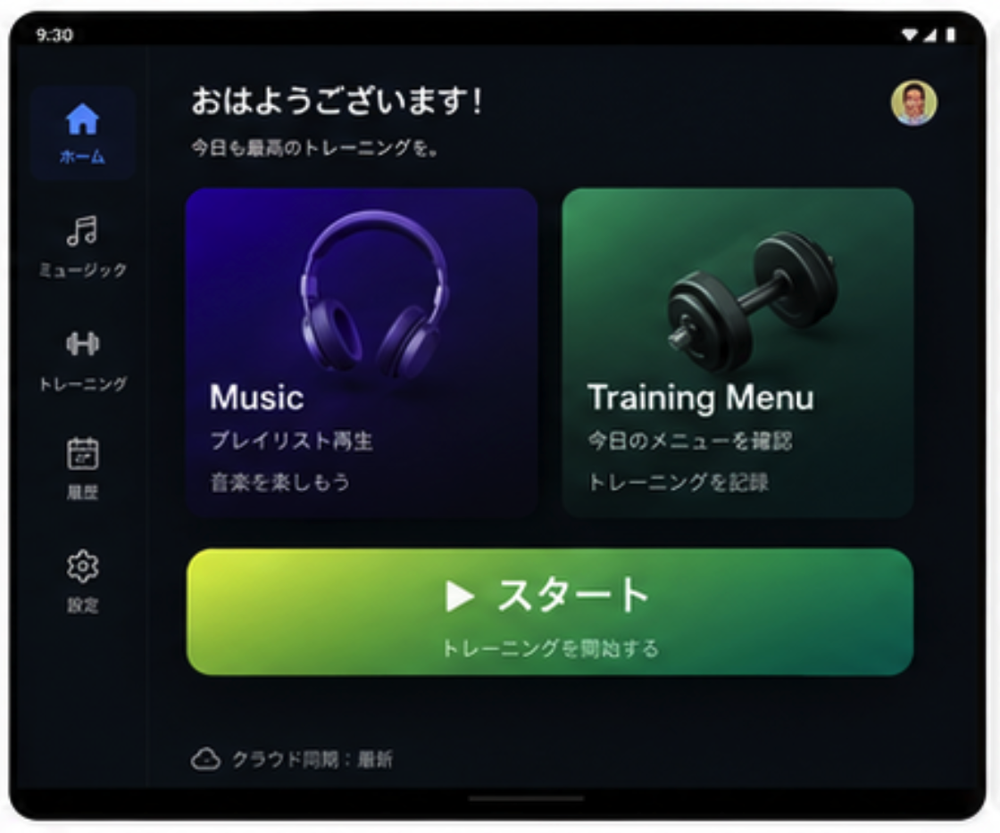
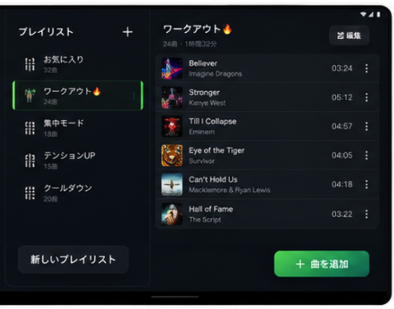
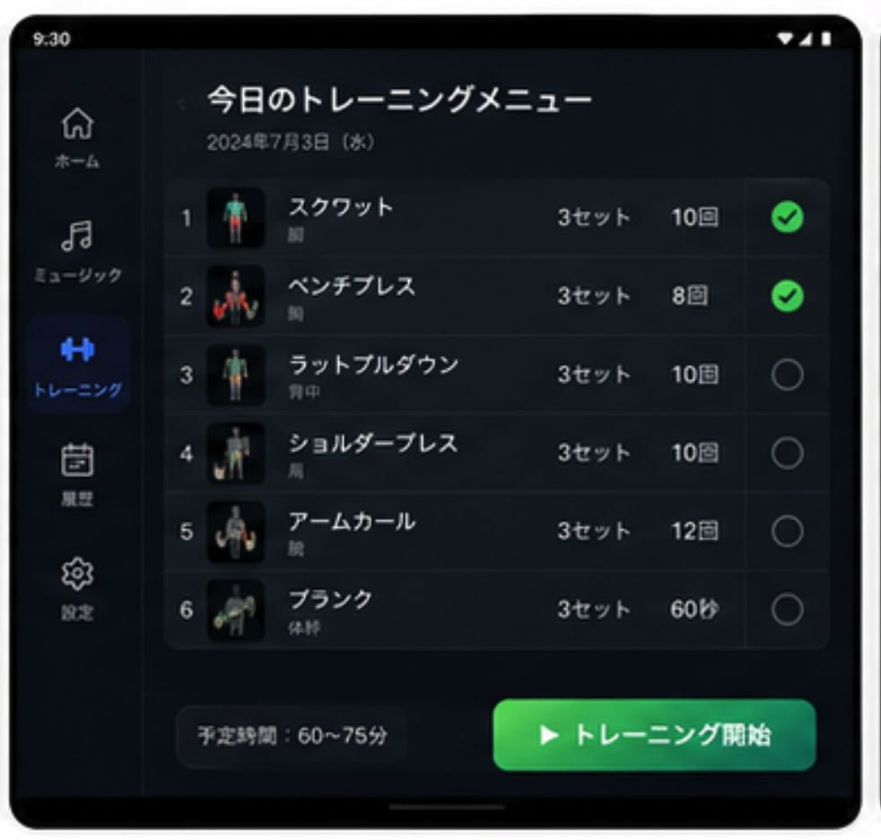
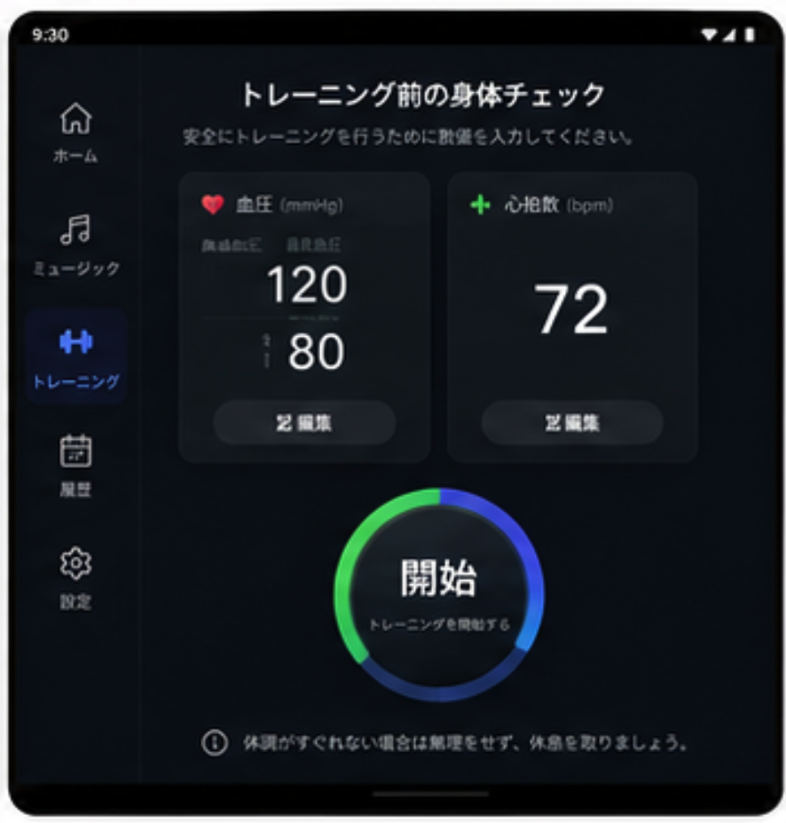
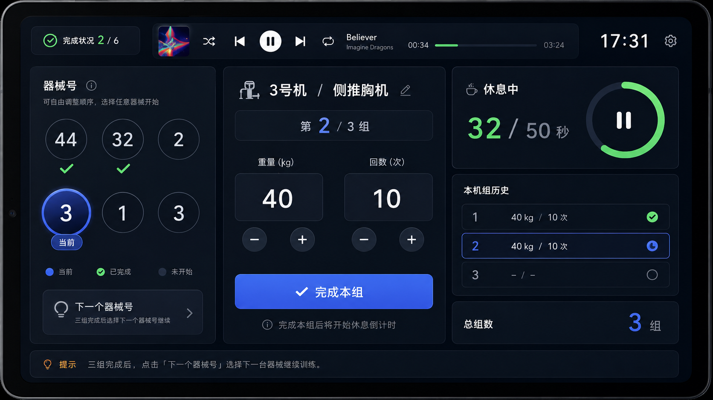
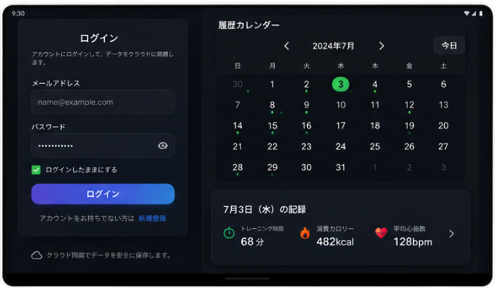
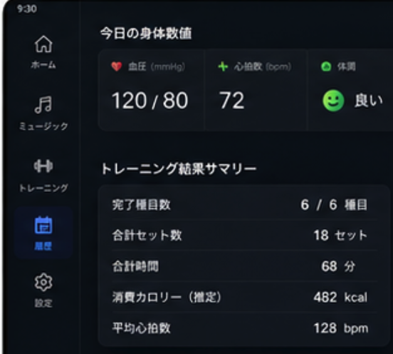

# App信息
- App名:GymPlayer
- App语言：日语 

我想做一个Android平板上跑的健身房辅助App，主要目的是记录每天的锻炼状况，还有就是能听歌。
我的这个健身房 App 以安卓平板为前提，采用横向界面布局。主要功能包括听歌、记录锻炼状态，具体如下：

主页面画面参考：

## 1. 听歌功能
   - 点击 Music 按钮跳转到歌单列表界面。
   - 左侧：新建歌单。创建歌单名后，选择设备中的文件夹，自动读取其中的音频文件（如 MP3、WAV、M4A 等）生成歌单。
   - 右侧：显示歌曲顺序。点击三条杠按钮，按住可上下左右拖拽调整歌曲顺序，点击保存即可。
   - 页面画面参考：

## 2. 锻炼功能
   - 点击“开始锻炼”，先进入Menu选择画面，页面画面参考：
   - 进入身体 Check 界面，输入高压、低压和脉搏。页面画面参考：
   - 输入完成后点击开始，进入锻炼主页面。
   - 锻炼结束后点击“结束”，进入今日身体数值记录界面。
   - 暂定记录项目：肌肉量、身体水分占比、体重。

### 主要想解决的痛点有几个：
1. 健身器械不一定是按照想要的顺序能用到的，因为健身房人多，器械顺序不同。所以左边那个号是器械号（机器号），表示当前处于该器械的状态。
2. 每个器械连续做三组。流程是：做之前输入重量，做完后输入次数，最后点完成。
3. 点完成后进入休息计时，计时 50 秒。
4. 计时结束后接着做，三组做完后结束，再选择下一个机器号继续。

### UI 布局要求：
- 页面画面参考：
- 音乐放在上面一排操作区，尺寸小一点，别太大。
- 主要画面是健身内容。
- 右上角显示时间。
- 左上角显示完成状态。

## 3. 历史记录功能
   - 展示日历视图，有锻炼记录的日期会标记。页面画面参考：
   - 点击具体日期，显示当天的锻炼细节，包括做了哪些运动以及最后测得的数值。页面画面参考：

## 4. 数据存储与登录
   - 数据存储在 Firebase Firestore 中。
   - 需要在设置中提供 Login 功能，采用邮箱+密码形式登录 Firebase auth。
   - 登录成功后同步数据。
   - 先让用户登录，然后获取Firebase Auth中的UserID，然后再允许用户使用。在有网的情况下登录成功后，除非用户在设置里按下“退出登录”外，程序启动后不用去联网检验用户Login到没到期，一律允许使用。

## 5. 离线与同步逻辑
   - 考虑到健身房可能无网，App 启动时默认不联网，数据先记录在本地。
   - 点击同步时，试探网络状态：
     - 若无网，提示“对不起，没有网”。
     - 若有网，上传数据并提示“你传成功了”。

## 6. 关于健身房器械情报的登录：
健身房器械这块的情报，我提前写在 Firestore 里。点同步时，从 Firestore 下载数据存到 App 里。

一般包含这些数据：
1. 器械名称
2. 器械图标
3. 器械号码
4. 需要做几组
5. 默认重量

联网点同步时，从 Firestore 下载器械数据存到 App；没网时一直读缓存。
你在做的时候设计数据结构，最后给我个数据设计文档（markdown）

# Firebase信息：
Firebase 的Google Android App所需的Key，放在"/docs/keys/google-services.json"里了。